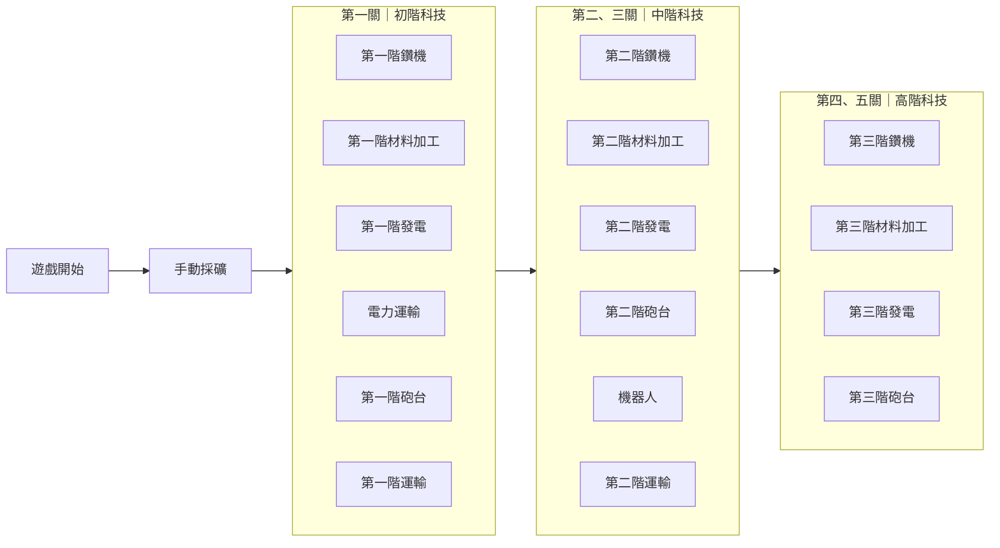

# 科技樹

```mermaid
flowchart LR

    START["遊戲開始"]
    A["手動採礦"]

    subgraph CH1["第一關｜初階科技"]
        direction LR
        B["第一階鑽機"]
        E["第一階材料加工"]
        H["第一階發電"]
        K["電力運輸"]
        L["第一階砲台"]
        P["第一階運輸"]
    end

    subgraph CH23["第二、三關｜中階科技"]
        direction LR
        C["第二階鑽機"]
        F["第二階材料加工"]
        I["第二階發電"]
        M["第二階砲台"]
        O["機器人"]
        Q["第二階運輸"]
    end

    subgraph CH45["第四、五關｜高階科技"]
        direction LR
        D["第三階鑽機"]
        G["第三階材料加工"]
        J["第三階發電"]
        N["第三階砲台"]
    end

    START --> A
    A --> CH1
    CH1 --> CH23
    CH23 --> CH45
```
